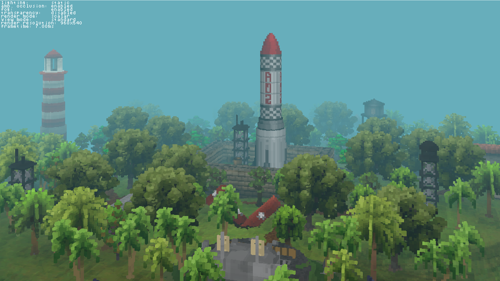
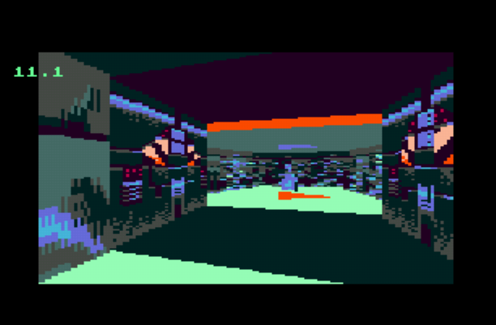
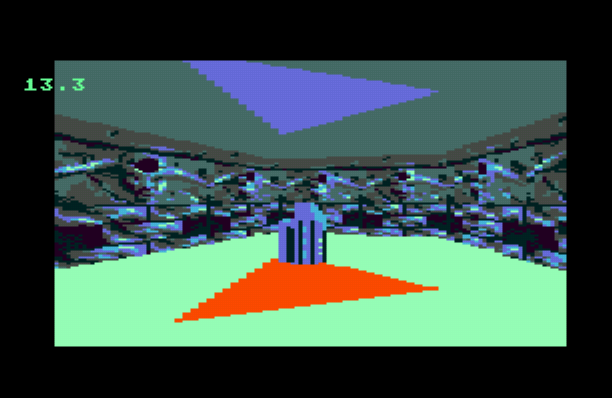

## Hello!

### I like working on graphics, compilers, games and all kinds of other cool projects.

### Projects
I also have a wiki page, but here are some of the cool projects I've been working on recently.

## Voxel renderer (2023-current)

### [Source code](https://github.com/ehaliewicz/voxel).

#### A foggy morning on rocket island

#### Voxel city

## Manifold (2020-current)

### A project to create an advanced 2.5D Graphics engine and map creation toolkit, for Sega Megadrive/Genesis.

### [Source code](https://github.com/ehaliewicz/manifold).

#### A dark hallway

#### A key in the room beyond

<!--
**ehaliewicz/ehaliewicz** is a ✨ _special_ ✨ repository because its `README.md` (this file) appears on your GitHub profile.

Here are some ideas to get you started:

- 🔭 I’m currently working on ...
- 🌱 I’m currently learning ...
- 👯 I’m looking to collaborate on ...
- 🤔 I’m looking for help with ...
- 💬 Ask me about ...
- 📫 How to reach me: ...
- 😄 Pronouns: ...
- ⚡ Fun fact: ...
-->
